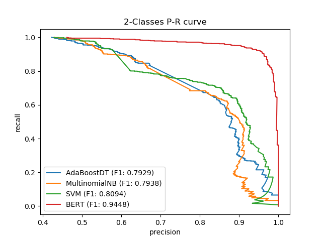

## Chinese Text Classification
- Author: **[XJay18](https://github.com/XJay18)**
- Last Updated Time: **July, 2020**

## Overview
This repo is originally an assignment for my NLP course. The objective of this assignment is to perform a *Chinese text classification task* on a Chinese text dataset. 

This dataset contains a training split with 20000 samples and a validation split with 2000 samples. A typical sample has the following form: `data_id|label|text` where the original labels are in the set of {0,1,4}. Label 0,1,4 stands for *normal words*, *abusive words* and *pornographic words* respectively. The goal is to classify a text sample into a positive sample (which belongs to pornography `4`) or a negative sample (which belongs to normal `0` or abuse `1`). Therefore, the classification task can effectively be treated as a *binary classification task*.

#### Best F1-Score
The best performance on the val dataset is achieved with `BERT`.

Below is the experiments and its corresponding performance. Best results are in **bold**.

|Model|Precision|Recall|F1|Config|
|:---:|:---:|:---:|:---:|:---:|
|MultinomialNB|81.06|80.05|79.38|alpha=0.0001|
|SVM|82.94|81.60|80.94|rbf kernel, C=1.8|
|AdaBoostDT|80.50|79.85|79.29|n_estimators=1000|
|BERT|**94.55**|**94.50**|**94.48**|[click me](\runs\BERT\2020-04-17...23.16.07\protocol.yml)|

#### P-R Curve Comparison (on val dataset)



## How to run it?
#### Requirements

Please refer to [this file](requirements.txt) to see the dependencies of this project. Below lists some of the important packages I use in this project:
- [sklearn](https://scikit-learn.org/stable/index.html)
- [pytorch](pytorch.org)==1.4
- [transformers](https://github.com/huggingface/transformers)

#### Prepare dataset for testing

- **Please note that you need to replace the `./path/to/data` in the codes with some appropriate paths.**

#### Run traditional machine learning algorithm on the dataset

1. To use the traditional machine learning algorithm, you can directly run the following command:

    ```bash
    python ml.py -v
    ```

    By default, this will use the `MultinomialNB` for classification.

    The full settings of `ml.py` script are (*you can run* `python ml.py --help` *to see the following infomation too*):

    ```
    usage: ml.py [-h] -d DATA [-c CONFIG] [-r RECORD] [-v] [-i]

    Run final result of text classification.

    optional arguments:
    -h, --help            show this help message and exit
    -d DATA, --data DATA  Specify the directory for 'train.bunch', 'val.bunch'
                            data files.
    -c CONFIG, --config CONFIG
                            Specify the config file to run the process.
    -r RECORD, --record RECORD
                            Specify the directory for records.
    -v, --verbose         Whether to show some of the estimations for val
                            samples.
    -i, --image           Whether to show the P-R Curve of this model.
    ```

1. **Config** file
    Please note that this section will introduce the config file for running <b style="color:red">only</b> `ml.py` script.

    The structure of the config file is:
    ```yaml
    model:
        name: MODEL_NAME
        other_arguments: VALUE
    ```
    I have provided three samples for running `MultinomialNB`, `SVM` and `AdaBoostDecisionTree`, you can use them directly. **Please refer to sklearn document to see the model's arguments that need to be specified.**

    ```yaml
    model:
       name: AdaBoostDT
       n_estimators: 1000
    ```
    ```yaml
    model:
        name: MultinomialNB
        alpha: 0.0001
    ```
    ```yaml
    model:
       name: SVM
       C: 1.8
       kernel: rbf
    ```
    The project provides these models for this task:
    ```python
    from sklearn.naive_bayes import MultinomialNB
    from sklearn.ensemble import RandomForestClassifier
    from sklearn.ensemble import AdaBoostClassifier
    from sklearn.ensemble import GradientBoostingClassifier
    from sklearn.linear_model import SGDClassifier
    from sklearn.neural_network import MLPClassifier
    from sklearn.svm import SVC

    ML_MODELS = {
        "MultinomialNB": MultinomialNB,
        "RandomForest": RandomForestClassifier,
        "AdaBoostDT": AdaBoostClassifier,
        "GradientBoostDT": GradientBoostingClassifier,
        "SGD": SGDClassifier,
        "MLP": MLPClassifier,
        "SVM": SVC
    }
    ```

1. **Results**
    After running the aforementioned command line, you will hopefully get all the results under `runs/` directory like this:
    ```
    ChineseTextClassification/
        - .../
        - runs/
            - MultinomialNB/
                - YYYY-MM-DD...HH.MM.SS/
                    - P-R.png
                    - pr.values
                    - records.txt
                    - results.txt
            - AdaBoostDT/
                - YYYY-MM-DD...HH.MM.SS/
                    - P-R.png
                    - pr.values
                    - records.txt
                    - results.txt
            - .../
    ```
    - **YYYY-MM-DD...HH.MM.SS** or other strings like this are the experiment id to specify an experiment.
    - **P-R.png** is the P-R Curve of the result for that particular experiment.
    - **pr.values** stores the [preision, recall] value pairs for plotting P-R Curve in the future. These values are achieved by calling `sklearn.metrics.precision_recall_curve` method. You can refer to the method document to see how to use this file.
    - **records.txt** stores the standard output when running `result.py` script.
    - **results.txt** stores the predictions in the format `data_id|predicted_label|text`


#### Run neural network (typically, BERT) on the dataset

Thanks to the great DL community, we currently can use the advanced DL algorithm easily and push forward the performances on various tasks. Therefore, I also try the famous `BERT` model for this task.

1. To test the performance with `BERT`, you can directly run the following command:
    ```bash
    python nn.py -s test
    ```
    By default, this will use [this file](bert.yml) as the protocol.

    Also, here are the full settings:
    ```
    usage: nn.py [-h] -s STAGE [-p PROTO] [-r RECORD] [-i]

    Run neural network for text classification.

    optional arguments:
    -h, --help            show this help message and exit
    -s STAGE, --stage STAGE
                            Specify the stage for the process, either 'train' or
                            'test'.
    -p PROTO, --proto PROTO
                            Specify the protocol file to run the process.
    -r RECORD, --record RECORD
                            Specify the directory for records.
    -i, --image           Whether to show the P-R Curve of this model.
    ```

1. **Protocol** file
    Please note that this section will introduce the protocol file for running <b style="color:red">only</b> `nn.py` script.
    
    An example of the protocol is like:
    ```yaml
    model:
        name: BERT
        num_classes: 2
    data:
        pad: 32
        train_path: ./path/to/data
        val_path: ./path/to/data
        train_batch_size: 100
        val_batch_size: 200
        skip_first: true  # Whether to skip the first line in the dataset
        delimiter: "\t"  # The delimiter in the dataset, like '\t' or '|'
    optimizer:
        lr: 0.00003
        weight_decay: 0.0005
    scheduler:
        name: MultiStepLR
        milestones: [8]
        gamma: 0.1
    num_steps: 1000
    device: 0
    log_steps: 100
    val_steps: 200
    id: YYYY-MM-DD...HH.MM.SS
    ckpt_fold: runs
    ```

    As you may **only evaluate** the performance on this task rather than train the model on the dataset, you just need to specify the value for `id` to select a existing model. **By default, I have put the best model's id in that field. Whew... so you can just neglect this section.**

1. **Results**
    After running the aforementioned command line, you will hopefully get all the results under `runs/` directory like this:
    ```
    ChineseTextClassification/
        - .../
        - runs/
            - BERT/
                - YYYY-MM-DD...HH.MM.SS/
                    - best_model.bin
                    - latest_model.bin
                    - protocol.yml
                    - P-R.png *
                    - pr.values *
                    - records.txt
                    - results.txt *
                    - tests.txt *
                - YYYY-MM-DD...HH.MM.SS/
                    - ...
    ```
    - **The file with name followed by * means that the file is generated during testing** (i.e., after running `python nn.py -s test`)
    - **Therefore, you can just check the file with name followed by * to see the performance on val dataset.**

## Epilogue
If you are confused of the project's settings or have any questions, feel free to email me: jaycao2008@126.com.
